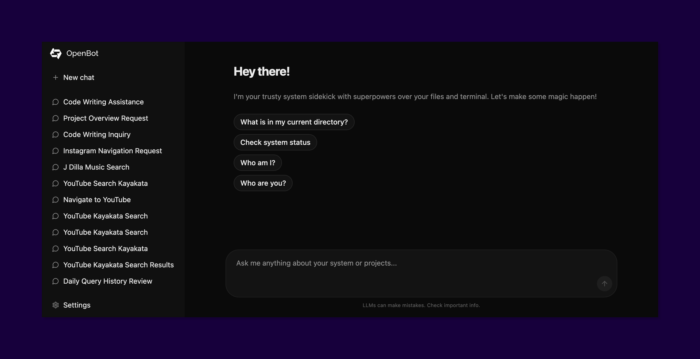

# 🤖 OpenBot

The ultimate AI sidekick that lives in your terminal and your browser. Built with [Melony](https://github.com/ddaras/melony), OpenBot can chat, browse the web, and manage files—giving you a powerful, real-time assistant for everything you do.



## 🚀 Quick Start

Get up and running in seconds:

```bash
# 1. Install OpenBot globally
npm i -g openbot

# 2. Start the server
openbot server

# 3. Launch the web UI (in a new terminal)
npx openbot-web
```

Once the web UI opens, you can **configure your model and API keys directly from the Settings tab**—no configuration files required! (Note: model names should follow the `provider/model` format, e.g., `openai/gpt-4o` or `anthropic/claude-3-5-sonnet-20240620`)

### 🌍 Want to browse the web?
Get started immediately by adding the official browser agent:

```bash
openbot add browser
```

## 📖 Documentation

Detailed documentation can be found in the [docs/](./docs/) folder:
- [Architecture](./docs/architecture.md)
- [CLI Reference](./docs/cli.md)
- [Plugins](./docs/plugins.md)
- [Agents](./docs/agents.md)

## 🏗️ Structure

- `server/`: The core AI agent and API server.
- `web/`: The React-based dashboard for interacting with your bots.

---

Built with ❤️ by the OpenBot team.
