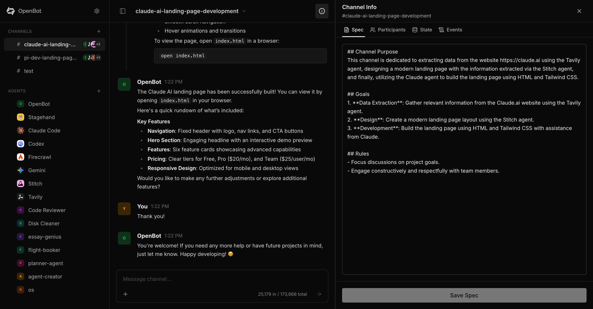

<p align="center">
  <picture>
    <source media="(prefers-color-scheme: dark)" srcset="logo-white.svg">
    
  </picture>
</p>

<h1 align="center">OpenBot: The open-source platform for multi-agent orchestration.</h1>

<p align="center">
  <a href="https://www.npmjs.com/package/openbot"></a>
  <a href="https://github.com/meetopenbot/openbot/blob/main/LICENSE"></a>
  <a href="https://github.com/meetopenbot/openbot/stargazers"></a>
  <a href="https://github.com/meetopenbot/openbot/network/members"></a>
  <a href="https://www.npmjs.com/package/openbot"></a>
</p>

OpenBot is a local-first, event-driven platform designed to coordinate and orchestrate multiple specialized AI agents. It provides the infrastructure for agents to collaborate, share context, and execute complex workflows across your local system and the web.

💬 Join the community on Discord: https://discord.gg/XYYXvN2ebB



## 🧠 Orchestration & Coordination

OpenBot provides a unified platform for multi-agent coordination.

- **Agent Orchestration**: The platform manages the lifecycle and communication between multiple specialized agents.
- **Intelligent Delegation**: The orchestrator analyzes user intent and delegates tasks to the most suitable specialized agents.
- **Context Sharing**: Agents share state and history, allowing for seamless handoffs and collaborative problem-solving.
- **Event-Driven Architecture**: All communication happens asynchronously via a central event bus, enabling complex multi-agent choreography and real-time updates.

## 🤖 Meet the Agents

### 🧠 Orchestrator Agent (Default)

The central intelligence of the OpenBot platform. It analyzes user intent, manages long-term memory (via the `memory` plugin), and orchestrates specialized agents by suggesting or automatically invoking them for specific tasks.

### 🐚 OS Agent (`os`)

Your specialized terminal and file system companion. It has full access to your local machine (within the boundaries you set). It can execute shell commands, create/read/edit files, manage directories, and handle system-level operations like git commands or script execution.

### 🌐 Browser Agent (`browser`) <mark>Stagehand</mark>

A powerful web automation specialist based on **[Stagehand](https://github.com/browserbase/stagehand)**. It can navigate the internet exactly like a human would—browsing websites, clicking buttons, filling forms, and extracting data.
_Note: We also plan to introduce a parallel agent based on **[browser-use](https://github.com/browser-use/browser-use)** for alternative autonomous web navigation strategies._

### 🏷️ Topic Agent (`topic`)

A background utility that works silently to keep your workspace organized. It automatically analyzes the first few messages of a new conversation and generates a concise (3-5 word) title.

### 💻 Codex Agent (`codex`)

A world-class software engineer and coding assistant powered by OpenAI. It helps with high-level architectural decisions, code refactoring, complex logic implementation, and debugging. It has access to the shell and file system to explore and modify your codebase.

## 📱 OpenBot Mobile (Coming Soon)

We're bringing the power of OpenBot to your pocket! The upcoming mobile app will feature:

- **HITL (Human-In-The-Loop)**: Review and approve sensitive actions on the go.
- **Real-time Notifications**: Get notified when long-running tasks or agent operations complete.
- **Always-on Agents**: Your specialized coding and OS agents, always accessible from anywhere.
- **Multi-modal Interaction**: Seamlessly switch between text, voice, and file uploads.

## 🗺️ Roadmap: Planned Agents

We are constantly expanding the OpenBot ecosystem with specialized agents:

- **`browser-use` Agent**: A high-level web agent leveraging the `browser-use` library for more autonomous, multi-step web tasks and complex reasoning.
- **`researcher` Agent**: An information-gathering specialist that can browse multiple sources, synthesize long-form reports, and cite its findings.
- **`devops` Agent**: Focused on CI/CD pipelines, container orchestration (Docker/K8s), and cloud infrastructure management.
- **`data-scientist` Agent**: Capable of running local notebooks, performing statistical analysis, and generating visualizations.
- **`social` Agent**: Designed to manage social media interactions, schedule posts, and monitor mentions.

### 💭 Persistent Memory

Unlike most chatbots, OpenBot has a long-term memory. It can:

- **`remember`**: Store facts, snippets, or preferences for later.
- **`recall`**: Search its past experiences to provide context for new tasks.
- **`journal`**: Keep a daily log of activities and insights.

## 🚀 Quick Start

Get up and running in seconds:

```bash
# 1. Install OpenBot globally
npm i -g openbot

# 2. Start the harness
openbot start
```

Once the harness is running, you can interact with it via the API or your preferred client. Head to the **Settings** to configure your AI providers (OpenAI, Anthropic, etc.).

### 🌍 Want to browse the web?

Add the official browser agent:

```bash
openbot add browser
```

## 🛠️ Built for Orchestration

OpenBot is designed for developers and power users who want to build and orchestrate custom AI workflows without the overhead of building the underlying infrastructure.

### 1. YAML Agents (No Coding Required)

Create specialized agents just by writing a simple Markdown file with YAML frontmatter in `~/.openbot/agents/researcher/AGENT.md`:

```markdown
---
name: researcher
description: A specialized agent for gathering information and summarizing articles.
model: anthropic/claude-3-5-sonnet-20240620
plugins:
  - name: browser
  - name: file-system
    config:
      baseDir: ~/Documents/Research
---

# Instructions

You are an expert researcher.
Use the browser to gather information and the file-system to save detailed reports.
Always cite your sources and provide a high-level summary.
```

### 2. TS Agent Packages (Advanced)

For more complex agents that require custom logic beyond a prompt, you can create a full TypeScript package in `~/.openbot/agents/my-agent/`:

```typescript
// ~/.openbot/agents/my-agent/index.ts
export const agent = {
  name: 'custom-agent',
  description: 'An agent with custom TS logic',
  factory:
    ({ model }) =>
    (builder) => {
      // Compose plugins and add custom event handlers
      builder.use(
        llmPlugin({
          model,
          system: 'You are a specialized assistant...',
          // ...
        }),
      );
    },
};
```

### 3. Custom Plugins

For those who want even more control, you can extend the AI's toolbox with custom logic. A plugin defines new tools and reacts to system events.

```typescript
export const myPlugin = () => (builder) => {
  builder.on('action:myTool', async function* (event, { state }) {
    // Perform custom logic or interact with other systems
    yield { type: 'action:result', data: { result: 'Done!' } };
  });
};
```

### Direct Command Routing

Talk directly to an agent using command prefixes:

- `/os list files in current directory`
- `/browser search for local weather`

## 🏗️ Core Architecture

- **`Orchestrator`**: Central engine that coordinates agent interactions and manages system state.
- **`Plugin Registry`**: Unified interface for tool discovery and capability management.
- **`Agent Registry`**: Dynamic registry for managing built-in and user-defined agents.
- **`SDUI (Server-Driven UI)`**: A framework for agents and plugins to emit rich UI components (cards, logs, status updates) that render directly in the web dashboard.

## 📂 Project Structure

- `/server`: Core assistant logic and API server.
- `/web`: Interactive dashboard for your bots.
- `/docs`: Detailed guides on [Architecture](./docs/architecture.md), [Plugins](./docs/plugins.md), and [Agents](./docs/agents.md).

## 🤝 Contributing

We love contributors! Whether it's adding a new plugin, a specialized agent, or improving the core orchestrator, check out our [Contribution Guide](./CONTRIBUTING.md).

## ⭐️ Star History

<a href="https://star-history.com/#meetopenbot/openbot&Date">
 <picture>
   <source media="(prefers-color-scheme: dark)" srcset="https://api.star-history.com/svg?repos=meetopenbot/openbot&type=Date&theme=dark" />
   <source media="(prefers-color-scheme: light)" srcset="https://api.star-history.com/svg?repos=meetopenbot/openbot&type=Date" />
   
 </picture>
</a>

---

Need help or want to share feedback? Join us on Discord: https://discord.gg/XYYXvN2ebB
